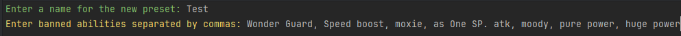
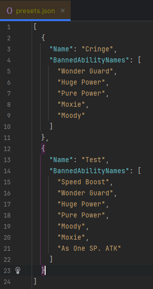

# 🌀 Random Ability Generator

[](https://github.com/SynxEU/Poke-Ability-Gen/blob/master/LICENSE)


A C# console app that randomly generates Pokémon abilities from a JSON file — with support for bans, presets, and cool console visuals.
## 📁 Project Structure
```text
├── Service/ 
│ ├── Presets.cs # Logic for confirming presets 
│ └── AbilityGenerator.cs # Filtering, randomizing, and displaying abilities 
│
├── Json/ 
│ ├── abilities.json # All ability data 
│ ├── presets.json # All preset data 
│ └── JsonReader.cs # Loads and parses JSON files 
│
├── Models/ 
│ ├── AbilityEntity.cs # Represents ability data 
│ ├── BannedAbilities.cs # Links presets to banned abilities 
│ └── Preset/ 
│     ├── FlattenPreset.cs # Flattened preset data from/to JSON 
│     └── PresetEntity.cs # Preset data after transformation 
│
├── Resources/ 
│ └── favicon.ico # App icon 
│
├── Prompts/ 
│ └── Prompt.cs # UI prompts and display logic 
│
├── Program.cs # Main entry point 
└── RandomAbilityGenerator.csproj # Project file
```

## ▶️ How It Works

1. The program loads all abilities from `abilities.json`.
2. The program loads all presets from `presets.json`.
3. The user can either create a new preset via the console prompts or manually edit `presets.json` to add a list of banned abilities.
4. The user inputs how many abilities to roll.
5. The program:
   - Filters out banned abilities based on the selected or created preset.
   - Randomly selects the requested number of unique abilities.
   - Displays each ability's name, generation, and description using `Spectre.Console` with rich formatting (tables, borders, colors).

## 💾 JSON Format

The abilities are loaded from a `Json/abilities.json` file. Each ability should look like this:
```json
{
   "id": 1,
   "name": "Stench",
   "genNumber": 3,
   "genName": "Hoenn",
   "desc": "Has a 10% chance of making target Pok\u00e9mon flinch with each hit."
}
```
⚠️ **Note**: Unicode escape sequences like \u00e9 represent characters such as é and will be correctly rendered in output. These escapes follow the C/C++/Java style encoding to ensure compatibility across different systems and tools.

The presets are loaded from a `Json/presets.json` file. Each preset should look like this:
```json
{
   "Name": "Cringe",
   "BannedAbilityNames": [
      "Wonder Guard",
      "Huge Power",
      "Pure Power",
      "Moxie",
      "Moody"
   ]
}
```

## 🔧 Setup Instructions
### ✅ Requirements
- [.NET 9 SDK](https://dotnet.microsoft.com/en-us/download/dotnet/9.0)
- [Spectre.Console](https://github.com/spectreconsole/spectre.console) — For enhanced console UI and prompts
- [VS Code](https://code.visualstudio.com/download) / [JetBrains Rider](https://www.jetbrains.com/rider/) / [Visual Studio](http://visualstudio.microsoft.com/downloads/) / CLI (Or CMD) - Native OS command line

### 📦 Build & Run
From project root:
```sh
dotnet build
dotnet run
```
Or press **Run** in your IDE (Rider/VS).

## 👀 How it looks
<details>
  <summary>Examples</summary>

### Display


### Create Preset
#### Inputs:

#### After Addition To JSON


</details>


## 📋 TODO
- [x] Add all known Pokémon abilities (I can find) to the JSON file
- [x] Add presets for ban lists

## ⛔ Issues/Missing abilities
Please submit an issue on the [Issues page](https://github.com/SynxEU/Poke-Ability-Gen/issues) if you encounter bugs or issues <br/>
If there are any missing abilities, feel free to contact me on Discord: **synx_eu**

## ⚖️ LICENSE
This project is using [MIT LICENSE](https://github.com/SynxEU/Poke-Ability-Gen/blob/master/LICENSE)

## 🙋 Author
Made by **SynxEU** <br/>
Created as a personal side project.
