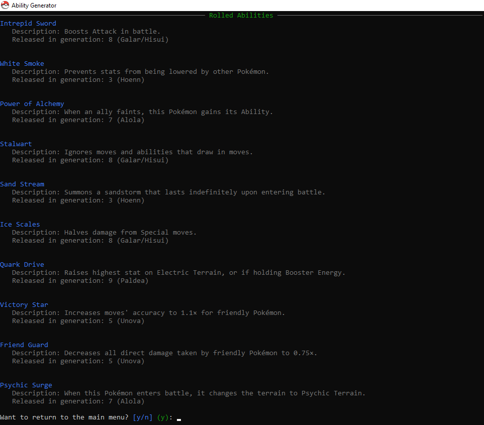

# 🌀 Random Ability Generator

A C# console app that randomly generates Pokémon abilities from a JSON file — with support for bans, presets, and cool console visuals.
## 📁 Project Structure

│ \
├── Service / \
│ ├── Presets.cs # Logic for confirming presets \
│ └── AbilityGenerator.cs # Logic for filtering, randomizing, and displaying abilities \
│ \
├── Json/ \
│ ├── abilities.json # JSON file containing all ability data \
│ ├── presets.json # JSON file containing all preset data \
│ └── JsonReader.cs # Loads and parses the abilities JSON \
│ \
├── Models / \
│ ├── AbilityEntity.cs # Holds ability data \
│ ├── BannedAbilities.cs # Joiner table between preset and ability \
│ └── Preset / \
│  ├── FlattenPreset.cs # Holds the preset data from and to the JSON file \
│  └── PresetEntity.cs # Holds the preset data after receiving it from FlattenPreset.cs \
│ \
├── Resources / \
│ └── favicon.ico # Icon for App \
│ \
├── Prompts / \
│ └── prompt.cs # Every prompt and other UI things \
│ \
├── Program.cs # Entry point with main console logic \
└── RandomAbilityGenerator.csproj

## ▶️ How It Works

1. The program loads all abilities from `abilities.json`.
2. The program loads all presets from `presets.json`.
3. The user can create a new preset by inputting ability names to ban.
4. The user inputs how many abilities to roll.
5. The program:
   - Filters out banned abilities based on the selected or created preset.
   - Randomly selects the requested number of unique abilities.
   - Displays each ability's name, generation, and description using Spectre.Console.

## 💾 JSON Format

The abilities are loaded from a `Json/abilities.json` file. Each ability should look like this:

```json
{
   "id": 1,
   "name": "Stench",
   "genNumber": 3,
   "genName": "Hoenn",
   "desc": "Has a 10% chance of making target Pok\u00e9mon flinch with each hit."
}
```

The presets are loaded from a `Json/presets.json` file. Each preset should look like this:

```json
{
   "Name": "Cringe",
   "BannedAbilityNames": [
      "Wonder Guard",
      "Huge Power",
      "Pure Power",
      "Moxie",
      "Moody"
   ]
}
```

## 🔧 Setup Instructions
### ✅ Requirements
- [.NET 9 SDK](https://dotnet.microsoft.com/en-us/download/dotnet/9.0)
- [Spectre.Console](https://github.com/spectreconsole/spectre.console) — For enhanced console UI and prompts
- [VS Code](https://code.visualstudio.com/download) / [JetBrains Rider](https://www.jetbrains.com/rider/) / [Visual Studio](http://visualstudio.microsoft.com/downloads/) / CLI (Or CMD) - Native OS command line

### 📦 Build & Run
From project root:
```sh
dotnet build
dotnet run
```
Or press **Run** in your IDE (Rider/VS).

## 👀 How it looks:
#### Ability example:



## 📋 TO:DO
- [x] Add every Pokémon ability (I can find) to the JSON file
- [x] Add presets for ban lists

## ⛔ Issues/Missing abilities
If you have any issues with the program please put it under the [Issues page](https://github.com/SynxEU/Poke-Ability-Gen/issues) \
If there is any missing abilities please contact me on discord: **synx_eu**

## 🙋 Author
Made by **SynxEU** \
Created as a personal side project.
